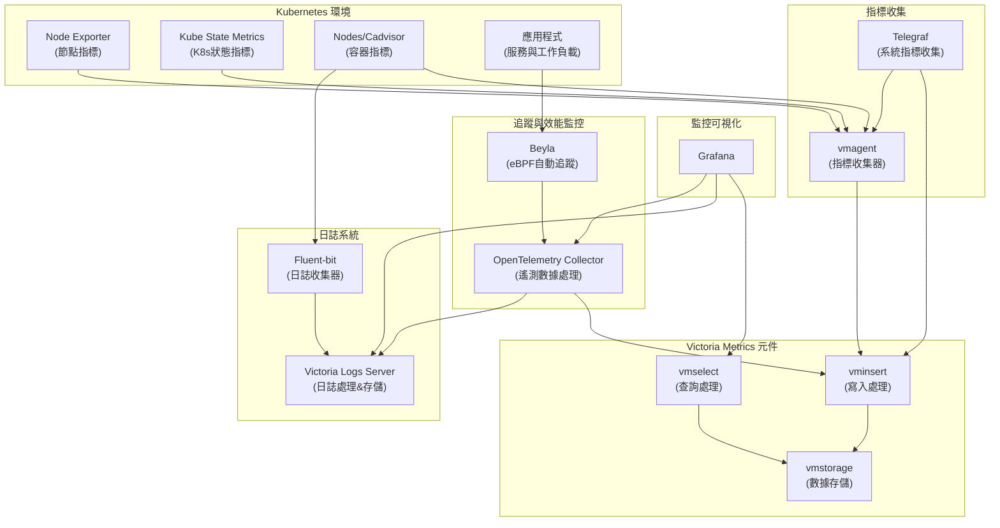

# vm-example-chart
[](https://github.com/neilkuan/vm-example-chart/actions/workflows/release.yml)
[](https://github.com/neilkuan/vm-example-chart/actions/workflows/pages/pages-build-deployment)


## 系統架構圖



## 元件說明

- **Grafana**: 用於可視化監控數據、日誌數據和追蹤數據
- **Victoria Metrics Cluster**:
  - **vmselect**: 處理查詢請求，從 vmstorage 檢索數據
  - **vminsert**: 接收 metrics 數據並寫入 vmstorage
  - **vmstorage**: 負責存儲 metrics 數據
- **Victoria Logs Server**: 處理和存儲日誌數據
- **資料收集元件**:
  - **Victoria Metrics Agent (vmagent)**: 收集指標數據並轉發到 vminsert
  - **Telegraf**: 收集系統和應用層級指標
  - **Fluent-bit**: 收集日誌並轉發到 Victoria Logs Server
- **追蹤與效能監控**:
  - **Beyla**: 基於 eBPF 技術的自動服務追蹤工具，無需修改應用程式
  - **OpenTelemetry Collector**: 處理和轉發遙測數據(指標、日誌和追蹤)
- **Kubernetes 指標來源**:
  - **node-exporter**: 提供節點級別的指標
  - **kube-state-metrics**: 提供 Kubernetes 物件狀態指標
  - **nodes/cadvisor**: 提供容器資源使用指標

## 數據流

1. **指標數據流**: 
   - Kubernetes 指標: node-exporter, kube-state-metrics 等產生指標 → vmagent 收集 → vminsert 寫入 → vmstorage 儲存 → vmselect 查詢 → Grafana 展示
   - 系統指標: Telegraf 收集 → vminsert/vmagent → vmstorage 儲存 → vmselect 查詢 → Grafana 展示
   
2. **日誌數據流**: 容器和節點產生日誌 → fluent-bit 收集 → Victoria Logs Server 處理和儲存 → Grafana 查詢和展示

3. **追蹤數據流**: 應用程式執行 → Beyla 自動捕獲追蹤數據 → OpenTelemetry Collector 處理 → 寫入 Victoria Metrics/Logs → Grafana 查詢和展示

## Use this chart
```bash
helm repo add vm-example-chart https://neilkuan.github.io/vm-example-chart/
```

## Normal release 
- Clone this project
  - `git clone https://github.com/neilkuan/vm-example-chart.git`
- Checkout new branch from main branch 
  - `git checkout -b feat-awesome-branch`
- make some magic 🪄
  - 🚨 🚨 🚨 do not forget update version in Chart.yaml 🚨 🚨 🚨
- Review by DevOps Team
- After merged , git tag version `v?.?.?` will trigger [workflow](https://github.com/neilkuan/vm-example-chart/actions/workflows/release.yml) release to `gh-pages` branch
  - `git tag v?.?.? && git push origin v?.?.?`

## Local build chart 
```bash
git checkout main
helm dependency build --skip-refresh

## make some magic 🚨 🚨 🚨 do not forget update version in Chart.yaml 🚨 🚨 🚨

```

## Local package chart 
```bash
## make some magic 🚨 🚨 🚨 do not forget update version in Chart.yaml 🚨 🚨 🚨

helm package .
```

## Local release chart 
```bash
git switch gh-pages

git pull origin gh-pages

rm -rf charts/

### Use none url 
helm repo index --url "" .

git add .

## 🚨 🚨 🚨 only need commit `index.yaml` and `vm-example-chart-x.x.x.tgz` 🚨 🚨 🚨
git status

git commit -a -m "release version"

git push origin gh-pages
```